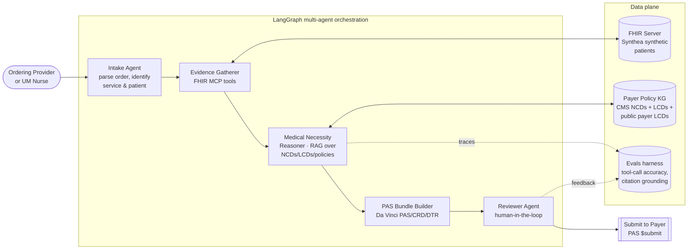

# Prior-Auth Co-pilot

> **Open-source, agentic, FHIR-native Prior Authorization co-pilot — built for the CMS-0057 January 2027 mandate.**

[](LICENSE)
[](docs/phases/)
[](https://hl7.org/fhir/R4/)
[](https://hl7.org/fhir/us/davinci-pas/)

---

## The problem

Prior Authorization (PA) is the single most-hated workflow in US healthcare — for patients, clinicians, and payers alike.

- The AMA's 2023 PA survey: physicians complete **~43 PA requests per week**, taking an average of **~12 hours** of practice time.
- **~94%** of physicians report PA delays in patient care; **~78%** say PA causes patients to abandon treatment.
- Today most PA traffic moves via fax, phone, and payer portals — a $25B+ annual administrative cost.

**The regulatory forcing function**: The CMS Interoperability and Prior Authorization Final Rule (**CMS-0057-F**) requires impacted payers to implement a **FHIR-based Prior Authorization API** — based on **HL7 Da Vinci PAS / CRD / DTR** — by **January 1, 2027**. Every major payer is scrambling. Provider-side tooling that can *talk* to those APIs barely exists.

This repo is a reference implementation of the provider-side, agentic co-pilot that closes that gap.

---

## What this builds

An agentic system that, given a patient and a proposed service (e.g., MRI lumbar spine, GLP-1 for obesity, advanced cardiac imaging):

1. **Auto-assembles the clinical evidence package** from EHR data via FHIR MCP tools.
2. **Reasons over the payer's medical necessity criteria** (CMS NCDs/LCDs + public payer policies) using RAG.
3. **Drafts the PA request** as a valid **Da Vinci PAS Bundle** (with CRD hooks and DTR-style structured data capture).
4. **Explains the decision** with citations back to specific payer-policy paragraphs.
5. **Routes to a human reviewer** before submission — utilization-management-nurse-in-the-loop by design.

---

## Architecture



### Key building blocks (reuses from existing repos)

| Building block | Reused from |
|---|---|
| FHIR MCP tools for evidence gathering | [`fhir-mcp-suite`](https://github.com/pcmedsinge/fhir-mcp-suite) |
| Payer policy knowledge base | [`FHIRPayerProvider_RCM_Knowledge`](https://github.com/pcmedsinge/FHIRPayerProvider_RCM_Knowledge) |
| FHIR resource construction patterns | [`fhir-mapping-agent`](https://github.com/pcmedsinge/fhir-mapping-agent) |
| Knowledge graph patterns | [`bodhi_app`](https://github.com/pcmedsinge/bodhi_app) |
| LangGraph orchestration patterns | [`cds-hooks-langgraph-agent`](https://github.com/pcmedsinge/cds-hooks-langgraph-agent) |

---

## Status & roadmap

Built in weekly slices. Each slice ships a runnable demo and a LinkedIn write-up.

| Sub-phase | Focus | Status |
|---|---|---|
| [4.1](docs/phases/4.1-problem-framing.md) | Problem framing, repo, architecture, LEADERSHIP.md, ADR-0001 | ▶ In progress |
| [4.2](docs/phases/4.2-evidence-retrieval.md) | Synthea data + FHIR MCP evidence retrieval | ⏳ Next |
| [4.3](docs/phases/4.3-medical-necessity-reasoner.md) | Medical necessity reasoner + RAG over NCDs/LCDs | ⏳ |
| [4.4](docs/phases/4.4-pas-bundle-reviewer.md) | Da Vinci PAS bundle builder + reviewer agent | ⏳ |
| [4.5](docs/phases/4.5-evals-release.md) | Evals harness, outcome metrics, v1.0 release | ⏳ |

Track live progress on the public [GitHub Projects board](https://github.com/users/pcmedsinge/projects) *(link will be live once board is created)*.

---

## Why this matters

This is the reference implementation that lets a 4-person provider-side or payer-side team **stand up a working PA pilot in weeks, not quarters** — against the CMS-0057 deadline. Open source, Apache-2.0, ADR-driven, with evals baked in from day one.

See **[`LEADERSHIP.md`](LEADERSHIP.md)** for how I would lead a squad shipping this for a real payer or provider client — staffing plan, hiring bar, eval gates, and runbook.

---

## Who this is for (personas)

- **Ordering provider** — wants an explainable PA draft, not another portal.
- **Utilization-management nurse** — needs an evidence-traceable, edit-before-submit workflow.
- **Payer reviewer** — receives a clean, standards-compliant PAS Bundle with citations.

Full persona briefs: [`docs/personas/`](docs/personas/).

---

## Repo layout

```
prior-auth-copilot/
├── README.md                   ← you are here
├── LEADERSHIP.md               ← how I'd lead a squad shipping this
├── LICENSE                     ← Apache-2.0
├── docs/
│   ├── adr/                    ← Architecture Decision Records
│   ├── personas/               ← user persona briefs
│   └── phases/                 ← sub-phase plans (4.1 → 4.5)
└── (code lands in Phase 4.2)
```

---

## Author

**Parag Medsinge** — [GitHub @pcmedsinge](https://github.com/pcmedsinge)
